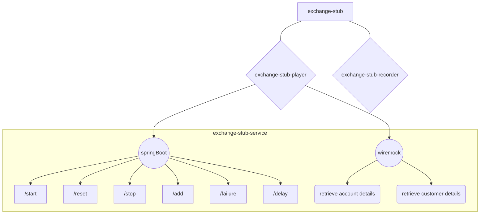

# Exchange Stub


**Table of Contents** 
  - [Exchange Stub](#exchange-stub)
    - [Introduction](#introduction)
    - [Who is it for?](#who-is-it-for)
    - [What does it do?](#what-does-this-service-do)
      - [tub-player ](#stub-player)
      - [stub-recorder](#stub-recorder)
    - [How do I use it?](#how-do-i-use-it-)
        - [local set-up](#pre-requisites)
        - [Code set-up](#code-setup)      
    - [How to run the code?](#how-do-i-run-the-code)
        - [Pre-requisites](#pre-requisites)
        - [Code Set-up](#code-setup) 
    - [What external libraries does this project use?](#what-libraries-does-this-project-use)
    - [Where are the response coming from?](#where-are-the-responses-coming-from)
    - [What does the wiremock mapping look like?](#what-does-the-wiremock-mapping-look-like)


# Introduction
Exchange stub is a micro-service that utilises WireMock framework to host stub data recorded directly from exchange (core-bank, ESP).
It stores recorded response files and mappings (from exchange) under the resources folder and uses WireMock to host them. 
We have also exposed admin endpoints that allows the users of exchange-stub (mainly developer and testers).
This allows adding of mock data, setting global error responses as well as global fixed / random delays (explored further [here](https://nwmworld.atlassian.net/wiki/spaces/CUR/pages/832929923/Exchange+Stub+-+API+Endpoints)).


# Who is it for?
- Mainly for developers and testers

# What does it do?
### exchange-stub-player 
- Exposes six endpoints that allow you to control the stub. 
- `Start | reset | stop` the Wiremock server using GET requests
- Set `random delay | fixed delay` and `global status code (200, 400, 401, 502)`
- Create stub responses for the url you want to hit and response you want it to return

### exchange-stub-recorder
- Makes requests to the exchange stub from a set of cins
- Records these responses under `__files` directory
- Records the `url` and `responseBody` in a wiremock `mappings` format


# How do I use it ?
### Local
SpringBoot App : `localhost:8080` + base url (`/cp/stub/exchange/v1`)

Wiremock Server : `localhost:9090`

Wiremock starts when the exchange stub SpringBoot application server is started.

### API specifications
The OpenAPI specifications for Admin and Customer inbox are available in Confluence. Please refer the below links to access the documentation:
* [Exchange Stub API](https://nwmworld.atlassian.net/wiki/spaces/CUR/pages/832929923/Exchange+Stub+-+API+Endpoints)


# How do I run the code?
### Pre-requisites
1) Active NatWest Markets MacBook & a @nwmworld.com account
2) `ZScaler` should be installed and ACTIVE at all times
3) Choose an IDE - `Eclipse` or `IntelliJ` as per choice, have the plugin of `Spring Boot` and `Lombok` installed.
4) Install: `homebrew`, `java 8`, `maven` 
``` bash
brew cask install java 
brew install maven
```
Use the [on-boarding guide](https://nwmworld.atlassian.net/wiki/spaces/CUR/pages/818086116/On-boarding+Guide) if you need further help in installing any of the pre-requisites

### Code Set-up
``` bash
git clone git@gitlab.com:nwmworld/services/third-parties/exchange-stub.git
cd exchange-stub
git checkout develop
mvn clean install -DskipTests
```

## What libraries does this project use?
- [lombok](https://projectlombok.org/) - to reduce boilerplate around entity classes
```xml
        <dependency>
            <groupId>org.projectlombok</groupId>
            <artifactId>lombok</artifactId>
            <version>1.16.16</version>
            <scope>provided</scope>
        </dependency>
```
- [swagger-ui](https://swagger.io/tools/swagger-ui/) - to render swagger html page for SpringBoot admin app at `http://localhost:8080/swagger-ui.html#/`
```xml

        <dependency>
            <groupId>io.springfox</groupId>
            <artifactId>springfox-swagger-ui</artifactId>
            <version>2.9.2</version>
        </dependency>
```
- [swagger-code-gen](https://swagger.io/tools/swagger-codegen/) - to generate the swagger DSL available to view in json through `http://localhost:8080/swagger-ui.html#/`
```xml
        <dependency>
            <groupId>io.springfox</groupId>
            <artifactId>springfox-swagger2</artifactId>
            <version>2.9.2</version>
        </dependency>

```
## Where are the responses coming from
Wiremock is configured to look under `exchange-stub-player/src/main/resources`

## What does the wiremock mapping look like 
`request` part sets what WireMock will respond to so below will respond to a `GET` request for `/v1/account/NWB/010039/01028014/flags`
`response` is what WireMock will return: status code of 200 with the content of the `bodyFileName`

```json
{
  "request": {
    "method": "GET",
    "url": "/v1/account/NWB/010039/01028014/flags"
  },
  "response": {
    "status": 200,
    "bodyFileName": "_v1_account_NWB_010039_01028014_flags_190000000_response.json"
  }
}
```
This is the `_v1_account_NWB_010039_01028014_flags_190000000_response.json`
```json
{
  "accountFlags" : {
    "AccountRestriction" : null
  },
  "accountName" : "FKUNFDRI YSKGBBESR"
}
```